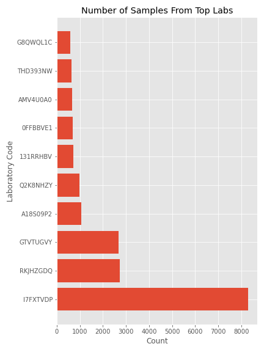

# Genetic Engineering Attribution

by Jacob Prebys

### Overview

Here I will have all of my work for the Genetic Engineering Attribution Challenge competition from DrivenData. The site gives the following motivation and overview for the competition:

> Genetic engineering attribution is the process of identifying the source of a genetically engineered piece of DNA. Reducing anonymity can encourage more responsible behavior within scientific and entrepreneurial communities, without stifling innovation. The objective of this competition is to predict the laboratory of origin for plasmid DNA sequence

### Data Acquisition

Like all DataDriven competitions, you must make an account and register for the competition before you can download the data. Once you have done that you can download the training features and training labels, both of which are ~300 MB .csv files. 

### Data Understanding

First thing to note is that there is a huge class imbalance here. One laboratory accounts for over 8,000 samples, while the average is 47 samples per lab. Two labs are only represented by one sample, so dealing with class imbalance will be a huge factor in increasing model performace. Here is 

### Modeling

As seen in the competition benchmark, one way of breaking down the gene sequences is to just count the individual subsequences. I used both overlapping and non-overlapping counters, but I have not been able to get a score higher than about 60%. My next idea was encode each subsequence as a number, and then turn the sequences into Numpy arrays representing the order of the subsequences. This way, all this information about the order is preserved, rather than just counting up subsequences. To start I will be using Keras with the Tensorflow backend, and I will just try to make a simple sequential, dense-layered NN. This work will be in the [fourth exploratory notebook](exploratory/04_jp_basicnn.ipynb).

# Contact Info

|  Github |         email         | LinkedIn |
|:-------:|:---------------------:|:--------:|
| jprebys | jacobprebys@gmail.com |  jprebys |

*Header illustration by Brian Stauffer*
